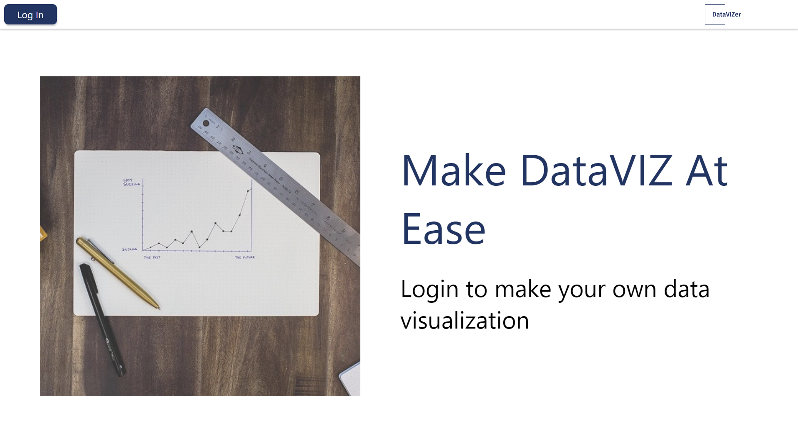
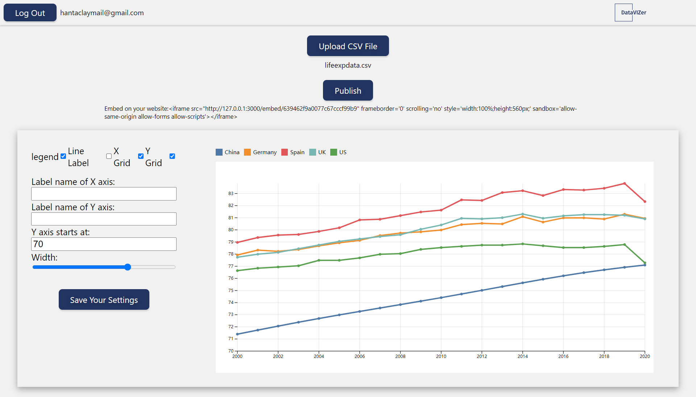
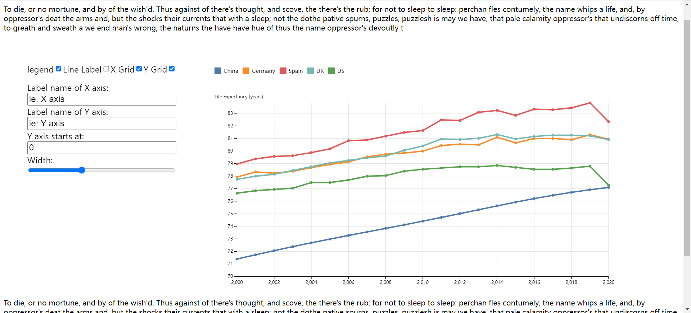

# DataVIZer



## 

DataVIZer is inspired by established data visualization tools like DataWrapper and Flourish but offers all functionalities for free. Users can log in to their own workspace and choose the visualization template they want. By uploading a formatted CSV file or a link from Google Forms, the app will generate an interactive graph for them. Users can then change the settings or design of the graph until satisfied. The graph can be published on the app or exported as a line of script for embedding afterwards.

## MVP

DataVIZer has just reached its MVP, Users should be able to upload a formatted CSV file following the instruction on the app to generate an interactive line chart.





## Getting started
To use DataVIZer, you can then clone this repository and install the required dependencies using the following commands:

You can fork this repository and clone it on your local environment.
Then in your terminal,
```console
cd datavizer
npm install
```

And then go to the front-end app folder by
```console
cd DataVIZer
npm install
```

Then do the same thing in the back-end app folder by
```console
cd..
cd server
npm install
```

Once the dependencies are installed, you need to create your own auth0 credentials in a .env file at the root level of front-end app. In this file, you need to put two values, 
```js
REACT_APP_AUTH0_DOMAIN
REACT_APP_AUTH0_CLIENT_ID
```

Do the same thing to the back-end, put your mongoDB connect URI as a string to a variable called, 
```js
DB_URI
```
Then you can start the DataVIZer app using the following command:

in the front-end app folder:
```console
npm start
```

in the back-end app folder:
```console
node index.js 
```

## Contributing
If you'd like to contribute to DataVIZer, please fork this repository and make your changes in a separate branch. Once you've tested your changes and are ready to submit them, you can open a pull request and we'll review your code. 

## License
DataVIZer is released under the MIT License.

## Tech stack

**Front End:**

DataVIZer is a React Web application. For data visualization, it utilized Observable.Plot library based on D3.

**Back End:**

Server built by Koa. Mongoose(Object Data Modeling) + Mongo Atlas(Cloud Database)

